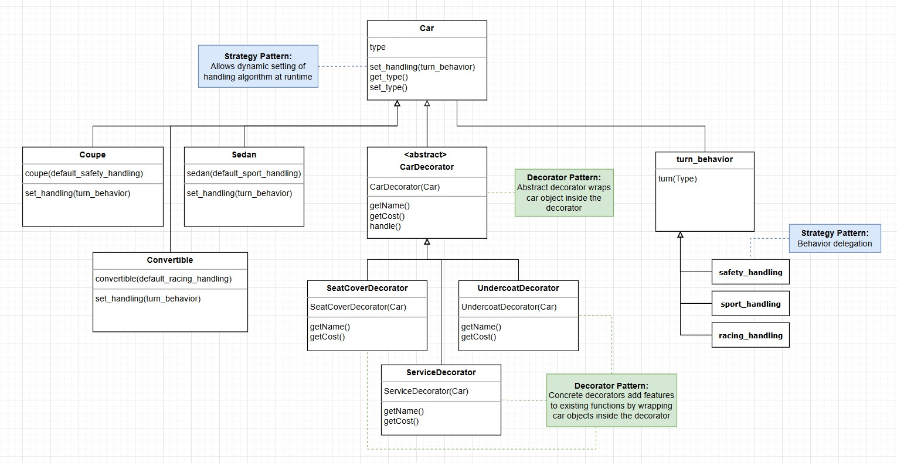

# 🚗 Car Factory Project  

## Use case: Customizable Car Configurator

This project simulates a car configurator, similar to what car dealerships or online car-buying platforms use.

- The Strategy Pattern ensures that different cars handle turns in unique ways (e.g., a sports car takes tighter turns than a family sedan).
- The Decorator Pattern allows customers to customize their cars dynamically—adding seat covers, undercoating, or prepaid service plans—without modifying the base car models.
For example, a customer might start with a basic Convertible and then add features dynamically based on their preferences:
    ```java
    Car myCar = new Convertible();
    myCar = new UndercoatDecorator(myCar);
    myCar = new SeatCoverDecorator(myCar);
    System.out.println(myCar.getName()); 
    // Output: Convertible 1 (add undercoat) (add seat cover)
    ```
This mirrors real-world applications like Tesla's online configurator or custom auto-shop services, where buyers can modify a base model without altering its core functionality.

## Object-Oriented Programming with Strategy & Decorator Patterns  

This project demonstrates the **Strategy Pattern** and **Decorator Pattern** in Java by modeling a **Car Factory** where:  
- Cars have **different handling behaviors** (`Strategy Pattern`).  
- Cars can be **customized dynamically** with additional features (`Decorator Pattern`).  

## Key Features  
- **Strategy Pattern**: Allows cars to have different turn-handling behaviors.  
- **Decorator Pattern**: Enables adding optional features (e.g., undercoat, seat covers) dynamically.  
- **Unit Testing with JUnit**: Ensures correctness of behaviors and cost calculations.  
- **Object-Oriented Design**: Follows best practices for maintainable code.  

## Design Patterns Used  

### **Strategy Pattern**  
- Used to allow **cars to have different handling behaviors dynamically**.  
- Implemented via a `TurnBehavior` interface with different handling strategies.  

    ```java
    public interface TurnBehavior {
        void turn();
    }
    ```

- Each car has a TurnBehavior that determines how it handles turns:
    ```java
    Car coupe = new Coupe(); // Defaults to SportHandling
    coupe.setTurnBehavior(new RacingHandling()); // Dynamically changes handling
    ```

### Decorator Pattern
- Allows dynamic customization of cars without modifying the base Car class.
- The CarDecorator wraps a Car object and modifies its behavior dynamically.

    ```java
    Car convertible = new Convertible();
    convertible = new UndercoatDecorator(convertible); // Adds undercoat
    convertible = new SeatCoverDecorator(convertible); // Adds seat covers
    System.out.println(convertible.getName()); 
    // Output: Convertible 1 (add undercoat) (add seat cover)
    ```

## UML Diagram
Below is the UML diagram for this project:



## Example Output
See below output when running Main.java:

``` pgsql
Name: Sedan 1
Cost: 10000
Handling: 
eases through turn
--------------------------
Name: Coupe 2 (add undercoat)
Cost: 15500
Handling: 
makes a right turn
--------------------------
Name: Convertible 4 (add undercoat) (add seat cover) (add seat cover) (add service visit) (add service visit)
Cost: 21800
Handling: 
skids through turn
--------------------------
```