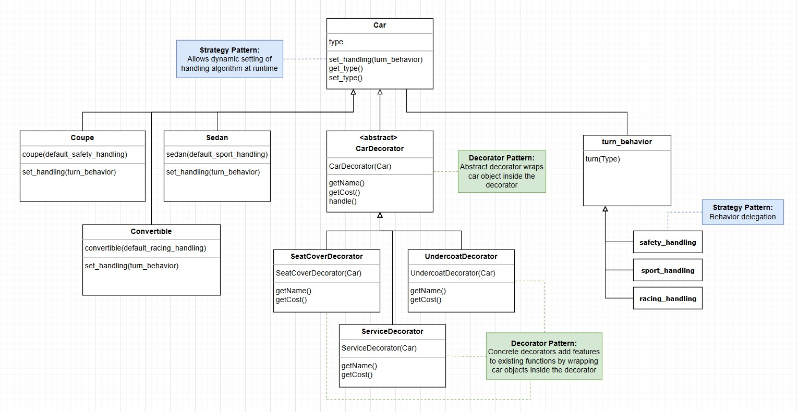

# 🚗 Car Factory Project  

## **Use Case: Customizable Car Configurator**
This project simulates a **car configurator**, similar to what car dealerships or online car-buying platforms use.

- **The Abstract Factory Pattern** ensures that different factories (US and Japan) produce cars with the correct components.
- **The Strategy Pattern** ensures that different cars handle turns in unique ways (e.g., a sports car takes tighter turns than a family sedan).
- **The Decorator Pattern** allows customers to dynamically customize their cars—adding seat covers, undercoating, or prepaid service plans—without modifying the base car models.

For example, a customer might start with a **basic Convertible** and then **add features dynamically**:

```java
Factory usFactory = new USFactory();
Car myCar = usFactory.createConvertible();
myCar = new UndercoatDecorator(myCar);
myCar = new SeatCoverDecorator(myCar);
System.out.println(myCar.getName());
// Output: USConvertible 3 (add undercoat) (add seat cover)
```
This mirrors real-world applications like Tesla's online configurator or custom auto-shop services, where buyers modify a base model without altering its core functionality.

## Object-Oriented Programming with Abstract Factory, Strategy, and Decorator Patterns

This project demonstrates three key design patterns in Java:

- Abstract Factory Pattern: Cars are produced at different factories (US and Japan), each providing region-specific components.
- Strategy Pattern: Cars have different turn-handling behaviors dynamically.
- Decorator Pattern: Cars can be customized dynamically with additional features.


## Key Features  
- Abstract Factory Pattern: Factories create cars with the correct components.
- Strategy Pattern: Allows cars to have different turn-handling behaviors dynamically.
- Decorator Pattern: Enables adding optional features dynamically.
- Unit Testing with JUnit: Ensures correctness of behaviors and cost calculations.
- Object-Oriented Design: Follows best practices for maintainable code.

## Design Patterns Used  

### Abstract Factory Pattern
- Factories produce cars with region-specific components.
- Each factory creates cars with the correct engine, suspension, and tires.

    ```java
    Factory usFactory = new USFactory();
    Car sedan = usFactory.createSedan();
    System.out.println(sedan.getComponents());
    // Output: Standard Engine, Standard Suspension, Standard Tires
    ```

### **Strategy Pattern**  
- Used to allow **cars to have different handling behaviors dynamically**.  
- Implemented via a `TurnBehavior` interface with different handling strategies.  

    ```java
    public interface TurnBehavior {
        void turn();
    }
    ```

- Each car has a TurnBehavior that determines how it handles turns:
    ```java
    Car coupe = new Coupe(); // Defaults to SportHandling
    coupe.setTurnBehavior(new RacingHandling()); // Dynamically changes handling
    ```

### Decorator Pattern
- Allows dynamic customization of cars without modifying the base Car class.
- The CarDecorator wraps a Car object and modifies its behavior dynamically.

    ```java
    Car convertible = new Convertible();
    convertible = new UndercoatDecorator(convertible); // Adds undercoat
    convertible = new SeatCoverDecorator(convertible); // Adds seat covers
    System.out.println(convertible.getName()); 
    // Output: Convertible 1 (add undercoat) (add seat cover)
    ```

## UML Diagram
Below is the UML diagram for this project:



## Example Output
See below output when running Main.java:

``` pgsql
🚗 Car Factory Output:
Name: USSedan 1
Cost: $13000
Components: Standard Engine, Standard Suspension, Standard Tires
---------------------------
Name: USCoupe 2
Cost: $18000
Components: Standard Engine, Racing Suspension, Racing Tires
---------------------------
Name: USConvertible 3
Cost: $23000
Components: Racing Engine, Racing Suspension, Racing Tires
---------------------------
Name: JapanSedan 4
Cost: $10000
Components: Economy Engine, Economy Suspension, Economy Tires
---------------------------
Name: JapanCoupe 5
Cost: $15000
Components: Sport Engine, Economy Suspension, Sport Tires
---------------------------
Name: JapanConvertible 6
Cost: $20000
Components: Sport Engine, Sport Suspension, Sport Tires
---------------------------
Name: USConvertible 7 (add undercoat) (add seat cover) (add seat cover) (add service visit) (add service visit)
Cost: $24800
Components: Racing Engine, Racing Suspension, Racing Tires
---------------------------
```