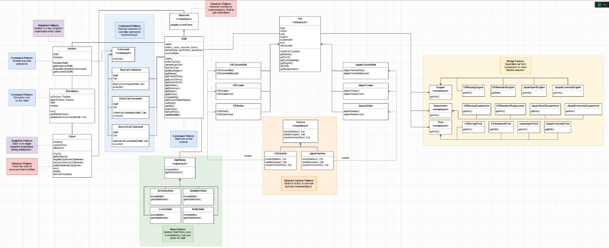

# 🚗 Car Factory Project -- Simulation

> **Note:** This project builds on the previous car factory project, adding a simulation for ten days.  Some files have been repeated, but because there are changes to many of the files, I have decided to add a separate copy.

## Overview
This project simulates a car dealership over multiple days, showcasing the integration of advanced object-oriented design principles using five key design patterns:

- **Command Pattern**: Encapsulates dealership actions (buying, servicing, ordering cars).
- **Observer Pattern**: A central clock notifies staff members of time changes.
- **State Pattern**: Staff availability changes based on their daily schedules.
- **Singleton Pattern**: Ensures a single instance of both the clock and command invoker.
- **Abstract Factory Pattern**: Produces cars with region-specific components (US vs. Japan).

The simulation mimics a real-world dealership scenario:

- The day progresses hour by hour.
- Customers request services, and available staff are randomly assigned to handle commands.
- Staff go through various availability states (arriving, available, at lunch, gone for the day).
- Bonuses accumulate for each action taken based on car prices.


## Object-Oriented Programming with Design Patterns

1. Command Pattern
    - Defines a command interface and concrete implementations for BuyCar, ServiceCar, and OrderCar.
    - Invoker executes commands, while Staff acts as the receiver.
1. Observer Pattern
    - Clock notifies all registered Staff on each tick (hour).
    - Staff update their state in response to the current time.
1. State Pattern
    - Staff objects manage their availability with states: ArrivingState, AvailableState, LunchState, and NotInState.
    - Actions can only be executed when staff are available.
1. Singleton Pattern
    - Clock is an eager singleton that controls the passage of time.
    - Invoker is a lazy singleton responsible for dispatching commands.
1. Abstract Factory Pattern
    - USFactory and JapanFactory generate sedans, coupes, and convertibles with correct region-specific components (engines, suspensions, tires).

## UML Diagram
Below is the UML diagram for this project:



## Example Output
See below output when running Main.java:

``` pgsql
Day 1:

Time now: 8 AM
Ann moved to Arriving at 8 AM
Sorry, Deb is NotIn
Ann is selling USCoupe 1 for $18000

Time now: 9 AM
Ann moved to Available at 9 AM
Bob moved to Arriving at 9 AM
Sorry, Deb is NotIn
Ann is selling JapanCoupe 2 for $15000

Time now: 10 AM
Bob moved to Available at 10 AM
Cal moved to Arriving at 10 AM
Ann is selling USConvertible 3 for $23000
...

Final Summary:
Ann:
Orders: 11
Services: 9
Sales: 15
Bonus: $12620.0
Bob:
Orders: 8
Services: 10
Sales: 12
Bonus: $8590.0
Cal:
Orders: 11
Services: 5
Sales: 7
Bonus: $9350.0
Deb:
Orders: 12
Services: 4
Sales: 6
Bonus: $8300.0
```